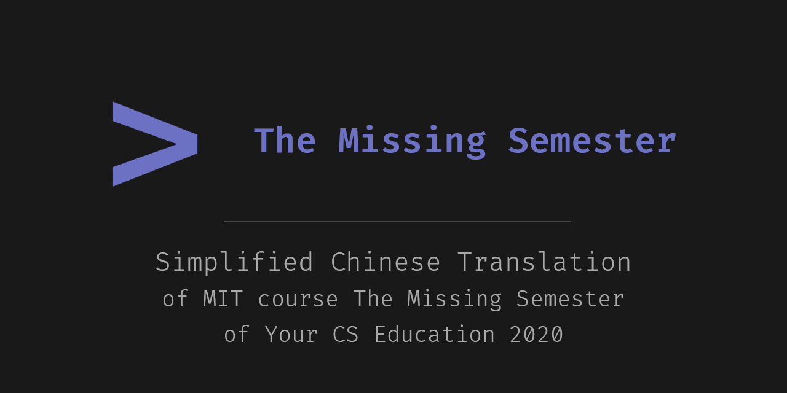
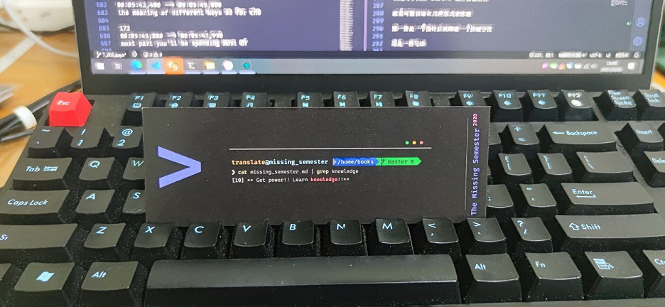
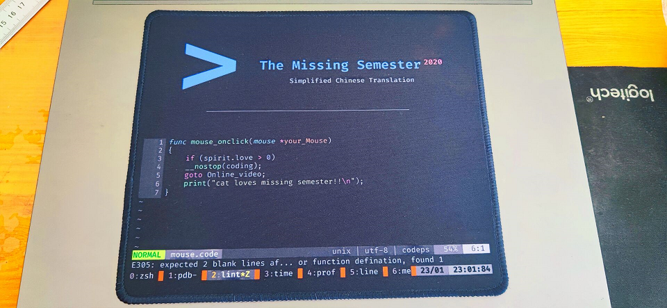

# MIT 课程《计算机科学教育中缺失的一课》简体中文翻译

------------

> 源字幕文件来源于 Youtube 发布的公开网络内容。

Missing Semester 是 MIT 的一系列公开课，内容聚焦于讲授计算机专业实用的软件工具、开发技巧等。

这一系列课程涵盖从命令行、文本编辑器、版本控制到代码调试等内容。

目前，我们尝试做一些微小的努力，把这一系列课程的中文翻译带给大家。

### 视频地址（已发布）：

[第一讲 - 课程概览与 Shell](https://www.bilibili.com/video/BV1Eo4y1d7KZ) - 2021/01/29

[第二讲 - Shell 工具和脚本]() - 

### 协议

本课程的所有内容，包括网站源代码、课程笔记、练习和课程视频均以署名-非商业性使用-相同方式共享 4.0 国际 [CC BY-NC-SA 4.0](https://creativecommons.org/licenses/by-nc-sa/4.0/) 协议授权。关于贡献和翻译，在[这里](license.md)获取更多信息。

### 字幕组成员（按有贡献计入，字母序）

翻译：

- alphaGem

- Coelacanthus

- GNAQ

- Hypo

- Zjrua

校对：

- GNAQ

- kernel.bin

时间轴：

- A179

- TardyPurcell

技术、压制：

- MikuNotFoundException

美术设计、质量总监：GNAQ - 联系方式 - [no1061234176@outlook.com](mailto:no1061234176@outlook.com)

### 进度：

> **[第二节 Shell 工具和脚本](https://missing-semester-cn.github.io/2020/shell-tools/)**
>
> 翻译 [OK]
> 校对 [running]
> 打轴 [running]
> 压制 [×]

> **[第三节 编辑器 (Vim)](https://missing-semester-cn.github.io/2020/editors/)**
>
> 翻译 [running]
> 校对 [×]
> 打轴 [×]
> 压制 [×]

> **[第四节 数据整理](https://missing-semester-cn.github.io/2020/data-wrangling/)**
>
> 翻译 [×]
> 校对 [×]
> 打轴 [×]
> 压制 [×]

### 题外话

为了犒劳我们辛勤工作的组员，我们定做了一批纪念品送给他们。

这批纪念品包括鼠标垫、钥匙扣、书签和一些贴纸。如果有余量的话，也会在 bili 官号抽奖发放给大家。

由于实物暂时还没有拿到，就只有设计图：

