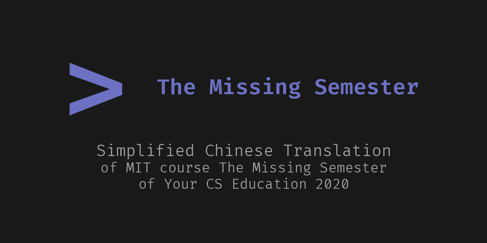

# MIT 课程《计算机科学教育中缺失的一课》简体中文翻译

------------

> 源字幕文件来源于 Youtube 发布的公开网络内容。

Missing Semester是MIT的一系列公开课，内容聚焦于讲授计算机专业实用的软件工具、开发技巧等。

这一系列课程涵盖从命令行、文本编辑器到版本控制等内容。

目前，我们做了一些微小的工作，试图把这一系列课程的中文翻译完成。

### 视频地址（已发布）：

[第一讲 - 课程概览与 Shell](https://www.bilibili.com/video/BV1Eo4y1d7KZ)

### 进度：

> **[第一节 课程概览与 shell](https://missing-semester-cn.github.io/2020/course-shell/)**
>
> 翻译 [√]
> 校对 [√]
> 打轴 [√]
> 压制 [√]

> **[第二节 Shell 工具和脚本](https://missing-semester-cn.github.io/2020/shell-tools/)**
>
> 翻译 [running]
> 校对 [×]
> 打轴 [×]
> 压制 [×]

### 小说明

为了方便查找，请尽量用如下格式处理 branch / PR

`(T/R/L/E)_ch(0,1,2...)_ID`

T 翻译 R 校对 L 时间轴 E 压制

例子：`R_ch5_GNAQ`

### 字幕组成员（按有贡献计入，字母序）

翻译：

- alphaGem

- Coelacanthus

- GNAQ

- Zjrua

校对：

- alphaGem

- GNAQ

- kernel.bin

时间轴：

- A179

- GNAQ

技术、压制：

- MikuNotFoundException

### 压制说明

#### Farmer's Embedding Method - Toolchain

农民压制法工具链。

使用 ```Chromium``` + ```Pyppeteer``` 渲染字幕图像，然后使用 ```numba``` JIT 优化过的 ```OpenCV``` 操作来将字幕逐帧附加到视频图片上，最后将视频图片拼接起来。

- 准备

	```plain
	- images/ (以X.png为格式逐帧存储原视频图像)
	- myaudio.m4a (原视频的音频文件)
	```

- 运行

	在 ```render_subtitle.py``` 内，修改```FILENAME``` 为使用的字幕文件后运行```render_subtitle.py```，等待完成后运行```render_image.py```，最后运行```generate_final_video.py``` 生成最终视频。
